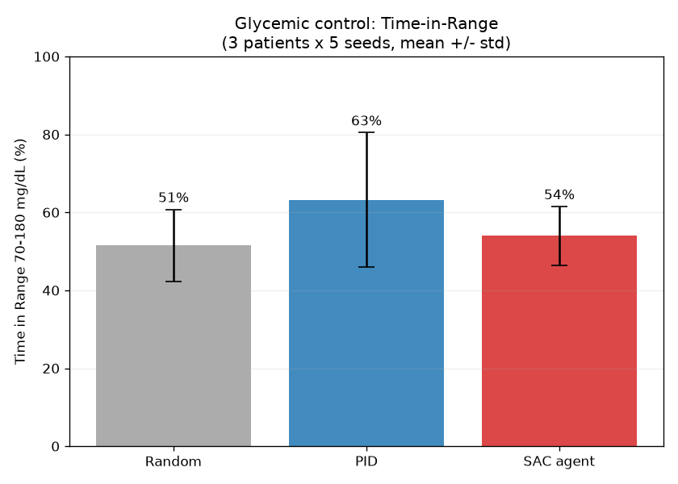

<div align="center">

# GlucoRL — Reinforcement Learning for Automated Insulin Dosing

**A deep reinforcement learning agent that learns to dose insulin to keep blood glucose in a safe range, trained on the FDA-accepted UVA/Padova Type-1 Diabetes simulator.**


</div>

---

> **Scope, stated honestly.** This project does **not** cure diabetes — a cure is a
> biological problem. It builds an **automated glucose-control / insulin-dosing**
> controller (an "artificial pancreas" policy), a real and active research area where
> reinforcement learning genuinely applies. The goal is to maximize **Time in Range**
> (70–180 mg/dL) while avoiding dangerous hypoglycemia.

## Table of Contents
- [Key Results](#key-results)
- [Why This Problem Is Hard](#why-this-problem-is-hard)
- [Problem Formulation (MDP)](#problem-formulation-mdp)
- [Approach](#approach)
- [Case Study: Diagnosing & Fixing a Failed Agent](#case-study-diagnosing--fixing-a-failed-agent)
- [Project Structure](#project-structure)
- [Installation](#installation)
- [Reproducing the Results](#reproducing-the-results)
- [Roadmap](#roadmap)
- [References & Acknowledgements](#references--acknowledgements)
- [License](#license)

## Key Results

> Evaluated on virtual patient `adolescent#001`, mean ± std over 5 random meal scenarios.
> One simulated day per run (480 control steps at 3-minute resolution).

| Controller | Time in Range ↑ | Time Hypoglycemic ↓ | Survived full day |
|---|---|---|---|
| Random insulin | 57.6% ± 1.6 | 42.4% | 0% |
| PID baseline | 84.0% ± 3.5 | 0.0% | 100% |
| SAC — naive action space *(failed)* | 53.3% ± 17.1 | 46.7% | 0% |
| **GlucoRL (SAC, corrected)** | **_pending final run_** | **_pending_** | **_pending_** |



*The learning curve and the GlucoRL-vs-PID trajectory comparison are added once the final training run completes.*

## Why This Problem Is Hard

Blood glucose is a delayed, noisy, and **asymmetric** control problem:

- **Delayed effect.** Injected insulin keeps lowering glucose for hours, so a dose now can cause a dangerous low much later — a hard credit-assignment problem.
- **Asymmetric risk.** Hypoglycemia (low) can cause seizures within minutes; hyperglycemia (high) is mostly a long-term harm. A good controller must treat lows as far worse than highs.
- **Partial observability.** A single glucose reading doesn't reveal whether glucose is rising or falling — the controller needs the *trend*.
- **Sensor noise.** The agent sees a noisy CGM signal, not the true blood glucose.

## Problem Formulation (MDP)

| Element | Definition |
|---|---|
| **State** | Last 4 CGM readings + last 4 insulin doses (8-dim), exposing glucose *trend* and *insulin-on-board* |
| **Action** | Basal insulin rate, continuous, in a clinically-scaled range `[0, 0.1]` U |
| **Reward** | Negative Magni glycemic risk (asymmetric — penalizes lows much harder than highs), with a terminal penalty for crashing the patient |
| **Transition** | The simglucose UVA/Padova physiological ODE model |
| **Discount** | γ = 0.99 (≈ 5-hour effective planning horizon) |

## Approach

**Environment.** [simglucose](https://github.com/jxx123/simglucose), an open-source implementation of the FDA-accepted UVA/Padova T1D simulator, wrapped as a Gymnasium environment.

**State engineering** (`diabetes_rl/wrappers.py`). A `GlucoseTrendWrapper` stacks recent glucose and insulin history so the agent can perceive trend and insulin-on-board — the single most important feature-engineering step.

**Reward design** (`diabetes_rl/rewards.py`). An asymmetric reward (Magni risk and an interpretable piecewise variant) that encodes the clinical priority: *never go low*.

**Algorithm.** [Soft Actor-Critic (SAC)](https://arxiv.org/abs/1801.01290) — an off-policy, continuous-control actor-critic method — via Stable-Baselines3. Insulin dosing is continuous, which rules out value-only methods like DQN.

**From-scratch implementation** (`diabetes_rl/sac_scratch.py`). SAC is *also* implemented from scratch in PyTorch (squashed-Gaussian policy, twin critics, automatic entropy tuning, polyak target updates) and validated against the Stable-Baselines3 version, to demonstrate understanding of the algorithm internals rather than just library usage.

**Baseline.** A correction-only PID controller (`diabetes_rl/baselines.py`) that observes the same CGM signal as the agent, for a fair head-to-head comparison.

## Case Study: Diagnosing & Fixing a Failed Agent

A first SAC run trained for **500,000 steps and failed completely** — 53% Time-in-Range and a crashed patient on every episode, *worse than random*.

**Diagnosis.** Inspecting the chosen doses revealed the agent was delivering **15–21 units** of insulin where the PID used **~0.01** — an overdose of ~1,000×. Root cause: the pump's action space `[0, 30]` is enormous relative to a useful basal dose (~0.01–0.05 U), so the safe region was ~0.03% of the action space — effectively unfindable — and SAC's neutral output (the midpoint, 15 U) was already a catastrophic overdose.

**Fix.** Rescaling the action space to a clinically-sane `[0, 0.1]` U. The agent immediately went from crashing the patient in ~1.2 hours to surviving the full day.

This before/after is documented with figures in [`docs/`](docs/) and is, deliberately, part of the project's story: identifying *why* a model fails is as important as training one that works.

## Project Structure

```
diabetes_rl/                  reusable package
├── envs.py                   simglucose Gymnasium env registration + factory
├── wrappers.py               GlucoseTrendWrapper (state + action scaling)
├── rewards.py                asymmetric reward functions (Magni, zone)
├── baselines.py              PID controller
├── metrics.py                glycemic metrics (Time-in-Range, etc.)
└── sac_scratch.py            SAC implemented from scratch in PyTorch
scripts/
├── check_env.py              environment sanity check (random policy)
├── pid_baseline.py           run + plot the PID baseline
├── train_sac.py              train SAC (Stable-Baselines3, parallel envs, checkpoints)
├── train_scratch.py          train the from-scratch SAC
├── evaluate.py               agent vs PID, head-to-head plot
├── benchmark.py              multi-patient × multi-seed benchmark (table + chart + CSV)
└── plot_training.py          learning curve from the eval logs
docs/                         figures and the methods deep-dive
requirements.txt              dependencies
requirements-lock.txt         exact pinned versions (reproducibility)
```

## Installation

Requires [Anaconda/Miniconda](https://docs.conda.io/). Tested on Windows with Python 3.11.

```bash
conda create -n diabetes-rl python=3.11 -y
conda activate diabetes-rl
pip install -r requirements.txt
```

For exact reproducibility, use the pinned versions: `pip install -r requirements-lock.txt`.

## Reproducing the Results

```bash
# 1. Sanity-check the environment (random policy)
python scripts/check_env.py

# 2. Run the PID baseline
python scripts/pid_baseline.py

# 3. Train the agent (parallel envs; checkpoints + best-model saving)
python scripts/train_sac.py --timesteps 200000 --n-envs 6

# 4. Plot the learning curve
python scripts/plot_training.py

# 5. Benchmark agent vs PID vs random (multi-patient, multi-seed)
python scripts/benchmark.py --model models/best/best_model --seeds 5

# Optional: watch training live
tensorboard --logdir logs
```

## Roadmap

- [x] Gymnasium environment, state/reward engineering, PID baseline
- [x] SAC training pipeline (parallel envs, checkpointing, best-model eval)
- [x] From-scratch SAC implementation in PyTorch
- [x] Rigorous multi-patient × multi-seed benchmark harness
- [x] Diagnosed & fixed the action-space failure mode
- [ ] Final trained agent that beats the PID baseline
- [ ] Reward ablation (Magni vs interpretable zone reward)
- [ ] State ablation (with vs without trend history)
- [ ] Cross-patient generalization (train on a subset, test on unseen patients)
- [ ] Validate from-scratch SAC matches Stable-Baselines3

## References & Acknowledgements

- Xie, J. *simglucose: a Type-1 Diabetes simulator* — https://github.com/jxx123/simglucose
- Man et al. (2014). *The UVA/PADOVA Type 1 Diabetes Simulator: New Features.* J. Diabetes Sci. Technol.
- Haarnoja et al. (2018). *Soft Actor-Critic.* https://arxiv.org/abs/1801.01290
- Magni et al. (2007). *Evaluating the efficacy of closed-loop glucose regulation.* (glycemic risk index)
- Raffin et al. (2021). *Stable-Baselines3.* JMLR.

A detailed code/architecture deep-dive is in [`Glucose_RL_Pipeline_Deep_Dive.docx`](Glucose_RL_Pipeline_Deep_Dive.docx).

## License

MIT — see [LICENSE](LICENSE).

---

<div align="center">
<sub>Built as a portfolio project exploring reinforcement learning for healthcare control problems.</sub>
</div>
