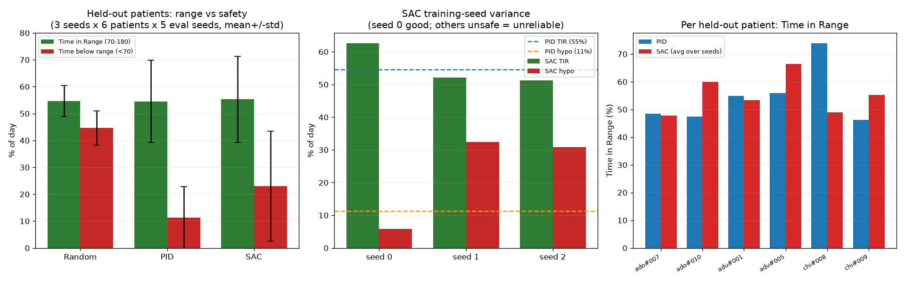

::: {align="center"}
# GlucoRL — Reinforcement Learning for Automated Insulin Dosing

**A deep reinforcement learning agent that learns to dose insulin to
keep blood glucose in a safe range, trained on the FDA-accepted
UVA/Padova Type-1 Diabetes simulator.**


:::

------------------------------------------------------------------------

> **Scope, stated honestly.** This project does **not** cure diabetes —
> a cure is a biological problem. It builds an **automated
> glucose-control / insulin-dosing** controller (an "artificial
> pancreas" policy), a real and active research area where reinforcement
> learning genuinely applies. The goal is to maximize **Time in Range**
> (70–180 mg/dL) while avoiding dangerous hypoglycemia.

## Table of Contents

-   [Key Results](#key-results)
-   [Why This Problem Is Hard](#why-this-problem-is-hard)
-   [Problem Formulation (MDP)](#problem-formulation-mdp)
-   [Approach](#approach)
-   [Case Study: Diagnosing & Fixing a Failed
    Agent](#case-study-diagnosing--fixing-a-failed-agent)
-   [Project Structure](#project-structure)
-   [Installation](#installation)
-   [Reproducing the Results](#reproducing-the-results)
-   [Roadmap](#roadmap)
-   [References & Acknowledgements](#references--acknowledgements)
-   [License](#license)

## Key Results {#key-results}

### Headline: multi-patient generalization study

The trustworthy result. Trained on **24 patients**, evaluated on **6
held-out (never-seen) patients**, across **3 independent training seeds** ×
5 random meal scenarios each — 90 simulated evaluation days per controller.

| Controller | Time in Range ↑ | Time Below Range (hypo) ↓ | Survived |
|----|----|----|----|
| Random insulin | 54.6% | 44.6% | 0% |
| **PID baseline** | 54.5% ± 15.3 | **11.2%** | **73%** |
| **GlucoRL (pooled SAC)** | 55.3% ± 16.0 | 23.0% | 57% |



**Honest finding: GlucoRL does *not* beat the PID.** It *ties* on
Time-in-Range (55% vs 54% — well inside the ±16 variance) and is **worse on
safety**: roughly double the hypoglycemia (23% vs 11%) and more crashes
(57% vs 73% survival).

The dominant effect is **training-seed variance**:

| SAC training seed | Time in Range | Hypo (TBR) | Survived |
|----|----|----|----|
| seed 0 | 62.6% | 5.8% | 90% |
| seed 1 | 52.1% | 32.5% | 47% |
| seed 2 | 51.2% | 30.9% | 33% |

One seed produced a genuinely good, *safe* controller; two produced unsafe
ones. **Seed 0 alone would have supported a confident "SAC beats PID and is
safer" claim — and that claim would have been wrong.** Reporting all three
is the point. Making the good seed *reproducible* (variance reduction + a
stronger hypoglycemia penalty) is the next piece of work.

### The development story (why the single-patient number is misleading)

Trained *and* evaluated on **one** patient (`adolescent#001`), GlucoRL looks
excellent — which is precisely the trap this project documents:

| Controller | Time in Range ↑ | Time Below Range (hypo) ↓ | Survived |
|----|----|----|----|
| Random insulin | 57.6% ± 1.6 | 42.4% | 0% |
| PID baseline | 84.0% ± 3.5 | 0.0% | 100% |
| SAC — naive `[0,30]` action space *(failed)* | 53.3% ± 17.1 | 46.7% | 0% |
| GlucoRL (SAC, corrected) | **92.3% ± 4.2** | 6.2% ± 5.2 | 100% |

92% Time-in-Range on the training patient — but it **overfits**, and 6.2%
time-below-range already exceeds the clinical safety target (**\<4%**). Each
step of the progression *single patient → held-out patients → multiple
seeds* strips away more of the illusion. **Only the last row of that
progression is trustworthy**, and it is reported above.

## Why This Problem Is Hard {#why-this-problem-is-hard}

Blood glucose is a delayed, noisy, and **asymmetric** control problem:

-   **Delayed effect.** Injected insulin keeps lowering glucose for
    hours, so a dose now can cause a dangerous low much later — a hard
    credit-assignment problem.
-   **Asymmetric risk.** Hypoglycemia (low) can cause seizures within
    minutes; hyperglycemia (high) is mostly a long-term harm. A good
    controller must treat lows as far worse than highs.
-   **Partial observability.** A single glucose reading doesn't reveal
    whether glucose is rising or falling — the controller needs the
    *trend*.
-   **Sensor noise.** The agent sees a noisy CGM signal, not the true
    blood glucose.

## Problem Formulation (MDP) {#problem-formulation-mdp}

| Element | Definition |
|----|----|
| **State** | Last 4 CGM readings + last 4 insulin doses (8-dim), exposing glucose *trend* and *insulin-on-board* |
| **Action** | Basal insulin rate, continuous, in a clinically-scaled range `[0, 0.1]` U |
| **Reward** | Negative Magni glycemic risk (asymmetric — penalizes lows much harder than highs), with a terminal penalty for crashing the patient |
| **Transition** | The simglucose UVA/Padova physiological ODE model |
| **Discount** | γ = 0.99 (≈ 5-hour effective planning horizon) |

## Approach {#approach}

**Environment.** [simglucose](https://github.com/jxx123/simglucose), an
open-source implementation of the FDA-accepted UVA/Padova T1D simulator,
wrapped as a Gymnasium environment.

**State engineering** (`diabetes_rl/wrappers.py`). A
`GlucoseTrendWrapper` stacks recent glucose and insulin history so the
agent can perceive trend and insulin-on-board — the single most
important feature-engineering step.

**Reward design** (`diabetes_rl/rewards.py`). An asymmetric reward
(Magni risk and an interpretable piecewise variant) that encodes the
clinical priority: *never go low*.

**Algorithm.** [Soft Actor-Critic
(SAC)](https://arxiv.org/abs/1801.01290) — an off-policy,
continuous-control actor-critic method — via Stable-Baselines3. Insulin
dosing is continuous, which rules out value-only methods like DQN.

**From-scratch implementation** (`diabetes_rl/sac_scratch.py`). SAC is
*also* implemented from scratch in PyTorch (squashed-Gaussian policy,
twin critics, automatic entropy tuning, polyak target updates) to
demonstrate understanding of the algorithm internals rather than just
library usage. *(A head-to-head validation that it matches the
Stable-Baselines3 version is planned — see Roadmap; not yet run.)*

**Baseline.** A correction-only PID controller
(`diabetes_rl/baselines.py`) that observes the same CGM signal as the
agent, for a fair head-to-head comparison.

## Case Study: Diagnosing & Fixing a Failed Agent

A first SAC run trained for **500,000 steps and failed completely** —
53% Time-in-Range and a crashed patient on every episode, *worse than
random*.

**Diagnosis.** Inspecting the chosen doses revealed the agent was
delivering **15–21 units** of insulin where the PID used **\~0.01** — an
overdose of \~1,000×. Root cause: the pump's action space `[0, 30]` is
enormous relative to a useful basal dose (\~0.01–0.05 U), so the safe
region was \~0.03% of the action space — effectively unfindable — and
SAC's neutral output (the midpoint, 15 U) was already a catastrophic
overdose.

**Fix.** Rescaling the action space to a clinically-sane `[0, 0.1]` U.
The agent immediately went from crashing the patient in \~1.2 hours to
surviving the full day.

This before/after is documented with figures in [`docs/`](docs/) and is,
deliberately, part of the project's story: identifying *why* a model
fails is as important as training one that works.

## Project Structure {#project-structure}

```         
diabetes_rl/                  reusable package
├── envs.py                   simglucose Gymnasium env registration + factory
├── wrappers.py               trend state, action scaling, patient resampling, env factory
├── cohorts.py                patient cohorts + held-out train/test splits
├── rewards.py                asymmetric reward functions (Magni, zone)
├── baselines.py              PID controller
├── metrics.py                glycemic metrics (Time-in-Range, etc.)
└── sac_scratch.py            SAC implemented from scratch in PyTorch
scripts/
├── check_env.py              environment sanity check (random policy)
├── pid_baseline.py           run + plot the PID baseline
├── train_sac.py              train SAC (single patient; parallel envs, checkpoints)
├── train_pooled.py           pooled multi-patient training, held-out model selection
├── train_scratch.py          train the from-scratch SAC
├── evaluate.py               agent vs PID, head-to-head plot
├── benchmark.py              multi-patient × multi-seed benchmark (+ significance test)
└── plot_training.py          learning curve from the eval logs
docs/                         figures and the methods deep-dive
requirements.txt              dependencies
requirements-lock.txt         exact pinned versions (reproducibility)
```

## Installation {#installation}

Requires [Anaconda/Miniconda](https://docs.conda.io/). Tested on Windows
with Python 3.11.

``` bash
conda create -n diabetes-rl python=3.11 -y
conda activate diabetes-rl
pip install -r requirements.txt
```

For exact reproducibility, use the pinned versions:
`pip install -r requirements-lock.txt`.

## Reproducing the Results {#reproducing-the-results}

``` bash
# 1. Sanity-check the environment (random policy)
python scripts/check_env.py

# 2. Run the PID baseline
python scripts/pid_baseline.py

# 3. Train the agent (parallel envs; checkpoints + best-model saving)
python scripts/train_sac.py --timesteps 200000 --n-envs 6

# 4. Plot the learning curve
python scripts/plot_training.py

# 5. Benchmark agent vs PID vs random (multi-patient, multi-seed)
python scripts/benchmark.py --model models/best/best_model --seeds 5

# 6. Generalization study: pooled training (24 train / 6 held-out patients),
#    then benchmark on the HELD-OUT set (train_pooled.py prints the exact command)
python scripts/train_pooled.py --timesteps 500000 --n-envs 6 --seed 0

# Optional: watch training live
tensorboard --logdir logs
```

## Roadmap {#roadmap}

-   [x] Gymnasium environment, state/reward engineering, PID baseline
-   [x] SAC training pipeline (parallel envs, checkpointing, best-model
    eval)
-   [x] From-scratch SAC implementation in PyTorch
-   [x] Rigorous multi-patient × multi-seed benchmark harness
-   [x] Diagnosed & fixed the action-space failure mode
-   [x] Agent beats PID on its *training* patient (92% vs 84% TIR) — but
    overfits to unseen patients (documented above)
-   [x] Cross-patient generalization study: pooled training on 24
    patients, held-out evaluation on 6 unseen patients × 3 training seeds
    — result: ties PID on Time-in-Range, worse on hypoglycemia, high
    seed variance (documented above)
-   [ ] **Reduce training-seed variance** and cut hypoglycemia (stronger
    hypo penalty / `zone` reward) so the seed-0 quality is reproducible
-   [ ] Reward ablation (Magni vs interpretable zone reward)
-   [ ] State ablation (with vs without trend history)
-   [ ] Stronger baselines (tuned PID, basal-bolus) + PPO/TD3 comparison
-   [ ] Validate from-scratch SAC matches Stable-Baselines3

## References & Acknowledgements

-   Xie, J. *simglucose: a Type-1 Diabetes simulator* —
    <https://github.com/jxx123/simglucose>
-   Man et al. (2014). *The UVA/PADOVA Type 1 Diabetes Simulator: New
    Features.* J. Diabetes Sci. Technol.
-   Haarnoja et al. (2018). *Soft Actor-Critic.*
    <https://arxiv.org/abs/1801.01290>
-   Magni et al. (2007). *Evaluating the efficacy of closed-loop glucose
    regulation.* (glycemic risk index)
-   Raffin et al. (2021). *Stable-Baselines3.* JMLR.

A detailed code/architecture deep-dive is in
[`Glucose_RL_Pipeline_Deep_Dive.docx`](Glucose_RL_Pipeline_Deep_Dive.docx).

## License {#license}

MIT — see [LICENSE](LICENSE).

------------------------------------------------------------------------

::: {align="center"}
<sub>Built as a portfolio project exploring reinforcement learning for
healthcare control problems.</sub>
:::
